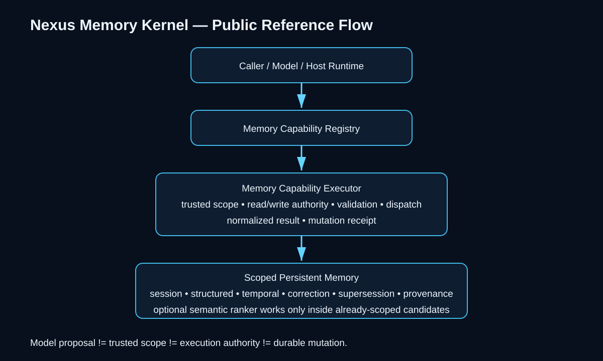
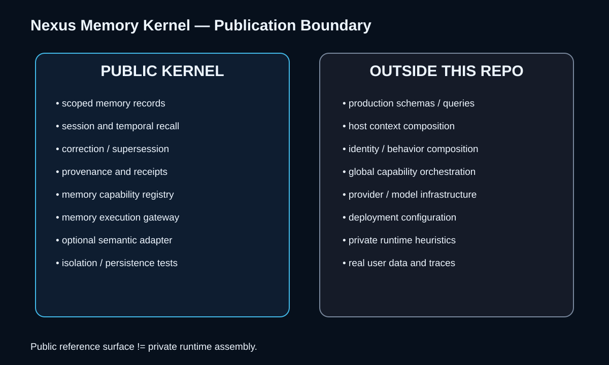

# Nexus Memory Kernel

> A bounded reference kernel for scoped persistent memory, recall, correction, provenance, and memory-capability execution.

**Status:** public reference implementation  
**Version:** 0.1.0  
**License:** Apache-2.0



## Why this exists

Memory inside an AI runtime is more than storing text.

A usable memory substrate must answer:

- Which trusted principal owns a memory?
- Which caller is allowed to read or mutate it?
- Is a memory active, corrected, or superseded?
- Can temporal recall be deterministic and inspectable?
- Can a model propose a memory operation without receiving storage authority?
- Can durable changes leave evidence?

## Reference flow

```text
caller / model / host
        |
        v
Memory Capability Registry
        |
        v
Memory Capability Executor
  - validate capability
  - validate arguments
  - accept trusted host scope
  - enforce read/write authority
  - dispatch bounded memory operation
  - normalize result
  - emit mutation receipt
        |
        v
Scoped Memory Store
  - session continuity
  - structured recall
  - temporal filtering
  - optional semantic ranking
  - correction / supersession
  - provenance
        |
        v
evidence-bearing result
```

The caller may propose an operation. Trusted scope and write authority remain host-owned.

## Included public capabilities

- `memory.search`
- `memory.context`
- `memory.inspect`
- `memory.store`
- `memory.correct`
- `memory.supersede`

These names and implementations are intentionally generic. They are a public reference surface, not the private Nexus runtime interface.

## Public boundary



This repository intentionally excludes private production schemas, query logic, context-composition rules, global capability orchestration, runtime configuration, deployment details, credentials, and real user data.

See [`PUBLIC_BOUNDARY.md`](PUBLIC_BOUNDARY.md).

## Run it

```bash
python -m unittest discover -s tests -v
python examples/basic_demo.py
```

The reference kernel requires only the Python standard library.

## Narrow claim set

This repository is intended to demonstrate only that:

1. persistent memory can remain scoped to a trusted principal;
2. memory capability proposal can remain separate from execution authority;
3. correction and supersession can preserve history;
4. temporal recall can be deterministic and testable;
5. durable mutations can emit inspectable receipts;
6. semantic ranking can be optional and operate only over already-scoped candidates.

See [`evidence/claims-and-evidence.json`](evidence/claims-and-evidence.json) for the machine-readable claim boundary.

It does **not** reproduce Nexus Synapse.
